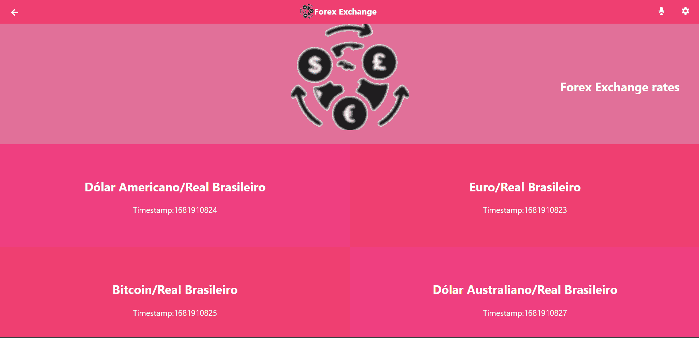
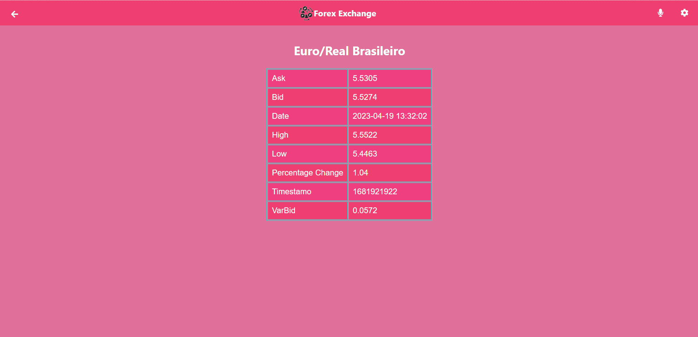

   

  <h3><b>Forex Exchange</b></h3>

# 📗 Table of Contents

- [📗 Table of Contents](#-table-of-contents)
- [Forex Exchange📖 ](#forex-exchange-)
  - [🛠 Built With ](#-built-with-)
    - [Tech Stack ](#tech-stack-)
    - [Key Features ](#key-features-)
  - [🚀 Live Demo ](#-live-demo-)
  - [📺 Presentation ](#-presentation-)
  - [💻 Getting Started ](#-getting-started-)
    - [Prerequisites](#prerequisites)
    - [Setup ](#setup-)
- [Usage ](#usage-)
  - [To run the project, execute the following command:](#to-run-the-project-execute-the-following-command)
    - [npm install](#npm-install)
    - [npm run build](#npm-run-build)
    - [npm run start](#npm-run-start)
    - [Run tests](#run-tests)
    - [Deployment ](#deployment-)
  - [👥 Author ](#-author-)
  - [🔭 Future Features ](#-future-features-)
  - [🤝 Contributing ](#-contributing-)
  - [⭐️ Show your support ](#️-show-your-support-)
  - [🙏 Acknowledgments ](#-acknowledgments-)
  - [❓ FAQ (OPTIONAL) ](#-faq-optional-)
  - [📝 License ](#-license-)

# Forex Exchange📖 

**Forex Exchange** This app consumes the [Awesome API](https://docs.awesomeapi.com.br/api-de-moedas#codigos-das-moedas). It usues the real time data for some of the exchange rates from API and provides details about the required exchange.

- The Home section displays a list of 18 different exchange rates. User can click if intersted in more details about a specific exchange.
  
  

- The Details Section displays more details of that exchange.

## 🛠 Built With 

- HTML.
- css.
- javaScript.
- React & redux
  

### Tech Stack 

  
Client

  <ul>
    <li><a href="https://www.w3schools.com/html/">HTML</a></li>
    <li><a href="https://www.w3schools.com/css/">CSS</a></li>
    <li><a href="https://www.javascript.com/">javaScript</a></li>
    <li><a href="https://react.dev/">React</a></li>
  </ul>

### Key Features 

- **React front end framwork**
- **Git-flow**
- **Es6 module**

(<a href="#readme-top">back to top</a>)

## 🚀 Live Demo 

- [You can check the live demo here](https://forex-exchange.onrender.com/)

(<a href="#readme-top">back to top</a>)

## 📺 Presentation 
- [ScreenRec Presentation](https://www.loom.com/share/942a2ca42b6a44fb99c707e81dff7f07?t=90)

## 💻 Getting Started 

1.install git, if you already have git installed skip this step.

2.open command terminal

3.navigate to the directory you want remote directory to be cloned to

4.go to the github and copy the url of the repository

5.clone the repository by typing git clone the url copied in step 4

6.Hit enter in the keyboard

7.navigate to the copy of your cloned repository using cd command

### Prerequisites

In order to run this project you need:

- Basic knowdlenge of HTML, CSS, javascript and the code editor of your choice.
- Basic knowlege of the computer operating system.

### Setup 

Clone this repository to your desired folder:

# Usage 

## To run the project, execute the following command:

### npm install

to install all the dependencies used in the project

### npm run build

to build this project from the source folder using webpack

### npm run start

in order to start a server and deploy the project localy

### Run tests

In order to run the tests, use the following command : <code> npm run test </code>

### Deployment 

You can deploy this project using: github pages or any host of your choice

(<a href="#readme-top">back to top</a>)

## 👥 Author 

👤 **Muhammed Nafees Geelani**

- GitHub: [@githubhandle](https://github.com/ngeelani48)
- LinkedIn: [LinkedIn](https://www.linkedin.com/in/ngeelani/)

(<a href="#readme-top">back to top</a>)

## 🔭 Future Features 

- [ ] **responsive for all devices**
- [ ] **adding search options**

(<a href="#readme-top">back to top</a>)

## 🤠Contributing 

Contributions, issues, and feature requests are welcome!

Feel free to check the [issues page](../../issues/).

(<a href="#readme-top">back to top</a>)

## ⭐️ Show your support 

If you like this project please give it a ⭐️.

(<a href="#readme-top">back to top</a>)

## 🙠Acknowledgments 

I would like to thank microverse for the oportunity to learn how to set up this project.

(<a href="#readme-top">back to top</a>)

## ❓ FAQ (OPTIONAL) 

- **how will i setup this project in local machine**

  - run the following command in the terminal: git clone https://github.com/ngeelani48/Stock-Metrics-WebApp.git

- **which code editor should i use**

  - You can use any editor of your choice but i recommend vs code.

(<a href="#readme-top">back to top</a>)

## 📠License 

This project is [MIT](./LICENSE) licensed.

(<a href="#readme-top">back to top</a>)
